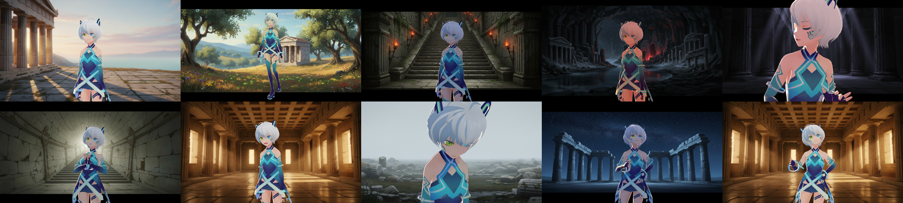
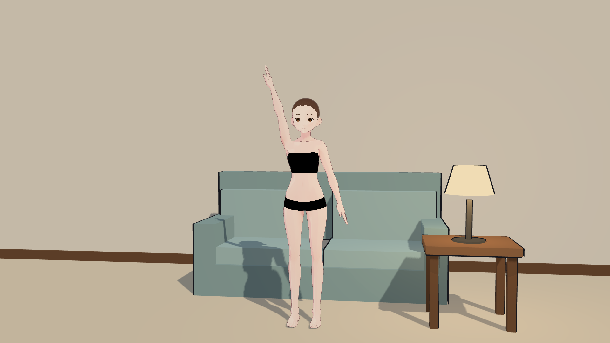
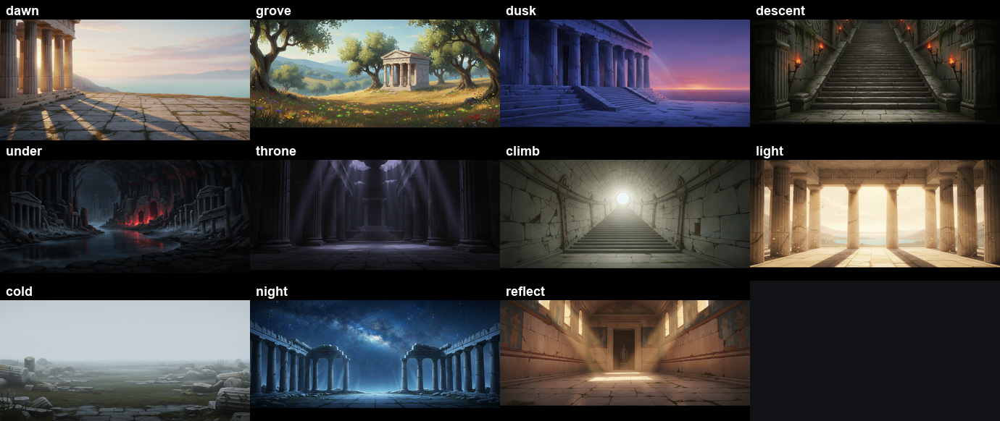
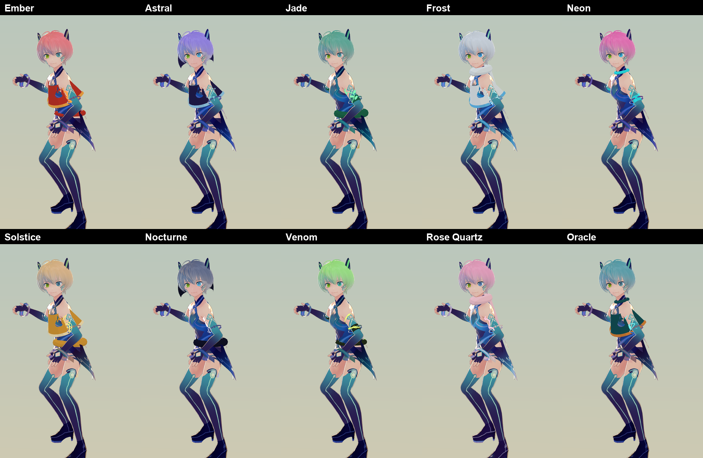

# vita-myth-studio

The engine behind **Ordinary Myths** (`@ordinarymyths`).

Narrated long-form video, rendered from a 3D character instead of generated frame by frame.
The character is **Vita** — hence the name — a VRM avatar performing real motion capture.

A ten-minute episode costs **about $0.86 and 7.4 minutes of compute** on a laptop. The
character is a VRM avatar performing real motion capture, standing in AI-generated
locations, lip-synced to a synthesised narrator. Nothing is generated per frame, so nothing
flickers and every render is identical.



## Focus, target and sources

| | |
| --- | --- |
| **Channel** | Ordinary Myths (`@ordinarymyths`) |
| **Niche** | `sleep-tales` — one complete traditional tale per part |
| **Target viewer** | adults who cannot sleep and want a story that *ends*: no cliffhanger, no next-episode hook, nothing that makes staying awake worthwhile |
| **Runtime** | ~10 minutes a part, read slowly |
| **Material** | traditional tales, genuinely out of copyright. Never a story by a named modern author, and never an invented "folk tale" |
| **Character** | Vita (VRM). Verify the licence embedded in any `.vrm` before monetising |
| **Motion** | Mixamo, free with an Adobe account |
| **Backdrops** | Gemini 3.1 Flash Image on Vertex, ~11 per episode. Prices in [BUDGET.md](BUDGET.md) |
| **Voice** | Kokoro-82M, local, free |

Competitor research — who else retells folklore at this length, what they title, and which
tales are already saturated — is researched against live Google Search. The current snapshot
is [docs/NICHE.md](docs/NICHE.md). It is generated, so regenerate it rather than editing it
by hand.

## Why not generate the frames

The obvious way to make this kind of video is to generate every shot with an image model.
At roughly $0.04 an image that is $500 for a ten-minute episode at 24fps, and the character
changes subtly between frames no matter how tightly you condition it.

Rendering a 3D character inverts both problems. The character cannot drift, because it is
the same mesh every frame. The cost moves from per-frame to per-*location*: this episode
generates **eleven** background images and reuses them across 13,436 frames.

| | |
| --- | --- |
| Example episode | 9:20, 1920×1080, 13,436 frames |
| Render time | 7.4 min (~30 fps, faster than real time) |
| Cost | ~$0.86, nearly all of it backdrops — see [BUDGET.md](BUDGET.md) |
| Voice | Kokoro-82M, local, free |
| Motion | Mixamo, free with an Adobe account |
| Backdrops | Gemini 3.1 Flash Image on Vertex — see [BUDGET.md](BUDGET.md) |

## How it works

```
content/<topic>.txt             the script — written by hand or generated
  ├─ build/script.py            Gemini on Vertex → content/<slug>.txt
  ├─ build/hooks.py             a SECOND pass: 10 hook variations for the first 15s
  ├─ build/tts.py               Kokoro → narration.wav + per-sentence timings
  ├─ build/envelope.py          narration → mouth-openness envelope (100 Hz)
  ├─ build/backdrops.py         Vertex → one location per story beat
  └─ build/render.mjs           shot plan → frames → ffmpeg → episode.mp4
       └─ build/plan.mjs        chooses motion, framing and expression per sentence
```

The stage is a single HTML page driven headlessly. It exposes `setFrame(shot, t, opts)`
and the renderer steps it one frame at a time, screenshotting each — not a screen
recording, so nothing drops under load and the render can be slower than real time without
affecting the result.

### Direction comes from the script

`plan.mjs` reads each sentence group and picks the motion, the camera and the facial
expression from what is being said:

```js
{ re: /\b(reach|bring her back|recover|undo it)/i, clip: ['reach-out'], frame: 'mid' }
{ re: /\b(grief|griev|mourn|wept|weep|tears)/i,   clip: ['crying'], frame: 'close',
  emotion: ['sad', 0.8] }
```

The first version cycled motions on a counter and produced a character waving cheerfully
through a death scene. Shots are cut on sentence groups, never mid-line.

### Motion retargeting

`stage/retarget.mjs` converts Mixamo's FBX motion onto a VRM humanoid: rotations are
rebased out of Mixamo's rest pose into the VRM's, hip translation is scaled by the height
ratio, and VRM 0.x models get X and Z negated. `stage/selftest.mjs` proves it without a
download, by synthesising a Mixamo-named skeleton and checking the result:



### Backdrops

Eleven locations, one per story beat, following the narrative rather than a timer — the
descent goes dark, the underworld red, the return bright.



### Looks

Palette and garment geometry are data. Garments are added as primitives parented to the
skeleton, so they animate with the character:



A VRM's clothes are baked into its mesh, so this changes colour and silhouette but cannot
swap in a genuinely different outfit. That is a VRoid Studio job.

### The three pillars

Topics, titles, thumbnails and hooks are checked against [docs/PILLARS.md](docs/PILLARS.md):
model proven winners rather than inventing; keep titles **broad**; thumbnails get **2–3
focus points**; and the **hook is prompted separately**, ten variations, one chosen. The
generator never ships a single title or a single hook.

### Production desk

`dashboard/index.html` is the review surface, organised by episode.

**Episodes** — open one to read its script paragraph by paragraph with a running timecode,
and to set the tone, pace and register you want on the next pass. Paragraphs over 45
seconds are flagged: those become one long shot unless the sentence grouping breaks them.
The settings rewrite nothing on their own; they record the intent, and are read back when
the script is regenerated.

**Episodes** — an episode opens to its hooks, script, then the title options, tags and
description, all generated from the script. Only the thumbnail is built later.

**Renders** — every output with its state and specs. The master is too large to play in a
page, so a 640×360 proxy of the same cut plays inline, which is enough to check pacing, lip
sync and whether the locations change.

**Backgrounds** — each location with the screen time it carries, not just the shot count: a
location can appear in three shots and hold a fifth of the episode. Retire one and it stays
out of future shot plans.

Tone settings and retired backgrounds persist to the artifact's own store, so they survive
a republish and can be read back when generating the next episode.

## Cost

A ten-minute episode costs **$0.45 – $1.67**, all of it backdrops. $300 of Google trial
credit is roughly **180–580 episodes**. Full arithmetic, including break-even views and an
urgent note about model deprecation, in [BUDGET.md](BUDGET.md).

## Quick start

```bash
npm install
bash scripts/setup.sh              # tells you which assets to fetch, and how

# script (or write content/<topic>.txt by hand)
GOOGLE_CLOUD_PROJECT=<id> python episode/build/script.py "Orpheus and Eurydice" --minutes 10

# narration
SCRIPT=orpheus python build/tts.py af_bella 1.0   # in episode/, with the Kokoro env
python build/envelope.py

# backgrounds (optional — falls back to gradients)
GOOGLE_CLOUD_PROJECT=<id> python episode/build/backdrops.py

npm run plan                        # print the shot plan, render nothing
npm run draft                       # 960×540 @12fps
npm run render                      # 1920×1080 @24fps
```

Requirements: Node 20+, ffmpeg, an installed Chrome (set `CHROME_PATH` if it is not in the
macOS default location), Python with `kokoro`, `soundfile` and `numpy`, and — only for
backdrops — `google-genai` with Application Default Credentials.

## Things that cost time, kept because each is invisible until it is expensive

**Root motion empties the frame.** Mixamo's "Talking Phone Pacing" walks several metres.
Against a fixed camera the character simply leaves, and the shot renders an empty room.
Clips are stripped to in-place, keeping Y so sits and bobs survive.

**Stripping translation does not strip rotation.** Several clips turn the body. On a wide
shot that is fine; on a close-up you get the back of the character's head. Tight shots
orbit to stay in front, taking facing from the *hips* so the camera holds still while the
character looks around within the frame.

**Frame against the model's height, not the head bone.** The bone sits inside the skull.
On the example character the gap is 17%, which crops the top of the head off every shot.

**Cycling visemes evenly makes a mouth look shut.** `ih` and `ee` are closed-mouth shapes,
so a loud syllable had a two-in-five chance of landing on one. Loudness picks the group.

**The image model ignores "16:9" in the prompt** and returns a square with white letterbox
bars. Aspect ratio is a config field.

**A keyword rule on "not" fires on everything.** In an essay-voiced script it matched 17%
of shots and the character spent the episode shaking her head.

**Inverted-hull outlines do not work on a skinned mesh by scaling it** — skinning
overwrites the vertex positions afterwards. The hull has to be pushed along the
post-skinning normal in the vertex shader.

**Garments parented to a bone inherit that bone's scale.** VRM bones are not unit-scaled; a
30cm shoulder cape became a cone that swallowed the character's head.

**Frames are never written to disk.** 13,436 stills at 1080p is roughly 20GB of PNG for a
file under 200MB. The renderer pipes JPEG straight into ffmpeg's stdin.

## Licences

The code here is MIT. **The assets are not redistributed** — see [NOTICE.md](NOTICE.md) for
what to fetch and under what terms. Short version: the VRM character and the Mixamo motion
files are licensed for use, not for redistribution, so `setup.sh` points you at the sources
rather than shipping them.
